# Star Cube

<p align="center">
  <a href="#espanol"></a>
  &nbsp;&nbsp;
  <a href="#english"></a>
</p>

<p align="center">
  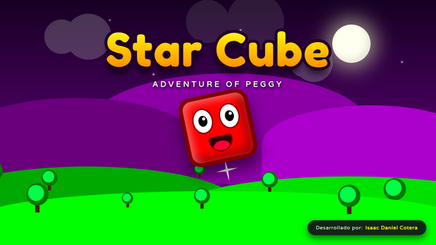
</p>

<p align="center">
  <a href="https://cotera2024.github.io/Star-Cube/"></a>
  <a href="https://cotera.itch.io/star-cube"></a>
  <a href="https://es.y8.com/games/starcube"></a>
  <a href="https://gamejolt.com/games/star-cube/1106176"></a>
</p>

<p align="center">
  
  
  
  
  
  
</p>

---

<a id="espanol"></a>
## Español

Un juego de plataformas y disparos 2D desarrollado completamente desde cero usando __Vanilla JavaScript__ y __HTML5 Canvas__. Todo el juego está diseñado al 100% con puro arte vectorial procedural nativo del navegador, ¡sin utilizar ningún sprite ni motores externos!

---

### Sobre el juego

Star Cube es un plataformero 2D centrado en el movimiento ágil: control aéreo preciso, dash multidireccional y disparos con carga gradual. Fue diseñado con un rendimiento ultra ligero para correr de forma fluida en cualquier navegador web moderno, tanto en computadoras como en dispositivos móviles.

Juegas como __Peggy__, un cubo con habilidades acrobáticas. Tu misión es rescatar a tus compañeros capturados a lo largo de seis zonas y derrotar a los jefes que controlan cada mundo.

---

### Jugar en línea directamente

Puedes jugar *Star Cube* ahora mismo en tu navegador sin instalar nada:

* **GitHub Pages (Jugar de inmediato):** [https://cotera2024.github.io/Star-Cube/](https://cotera2024.github.io/Star-Cube/)
* **Y8 Games (Portal Mundial):** [https://es.y8.com/games/starcube](https://es.y8.com/games/starcube)
* **Itch.io (Comunidad y comentarios):** [https://cotera.itch.io/star-cube](https://cotera.itch.io/star-cube)
* **Game Jolt (Comunidad y descargas):** [https://gamejolt.com/games/star-cube/1106176](https://gamejolt.com/games/star-cube/1106176)

---

### Características del Juego

- __6 Mundos y Jefes Únicos__:
  1. __Mundo 1:__ Explora la hermosa pradera del amanecer y las deslumbrantes cavernas heladas. Enfréntate al espectro gélido (Ice Cube) que lanzó una maldición sobre la pradera, transformándola en un infierno helado.
  2. __Mundo 2:__ Aventúrate en un mundo digitalizado. Lucha contra enemigos eléctricos y el peligroso MawlerKnight, que hará todo lo posible por alterar el sistema y hacerte explotar en un billón de bits con su inversión de controles.
  3. __Mundo 3:__ Sobrevive a los ríos de lava del volcán ardiente y derrota a la Centinela Valkyrie antes de que te reduzca a cenizas.
  4. __Mundo 4:__ Navega en tu barca sorteando el oleaje del mar tempestuoso y desciende a las fosas abisales para enfrentar al Krakatoa Kraken.
  5. __Mundo 5:__ Adéntrate en oscuras mazmorras y supera desafíos de precisión pura para rescatar a tus aliados atrapados.
  6. __Mundo 6:__ Noche de Halloween. Sobrevive a la niebla con tu linterna interactiva y escapa de la persecución contrarreloj de La Gran Calabaza.
- __Sub-mundos Dinámicos__: Portales y zonas subterráneas que cambian drásticamente las mecánicas, la gravedad, la visibilidad y el entorno del nivel.
- __Post-Game Oscuro__: Al completar la aventura principal, el juego sufre una metamorfosis. Toda la atmósfera se transforma en un entorno oscuro y terrorífico con diálogos alterados, aumento radical de la dificultad y el modo "La Cacería" (mecánicas de persecución y combate cuerpo a cuerpo).
- __Soporte Multi-idioma__: Traducción completa e integrada en Español, Inglés, Japonés, Ruso y Chino con selector interactivo y auto-detección.
- __Soporte Completo para Móviles y PC__:
  - __Móvil:__ Controles táctiles virtuales en pantalla diseñados a medida, con soporte multitáctil, gestos y respuesta háptica.
  - __PC:__ Teclado y soporte nativo para Gamepads (Xbox, PlayStation, mandos genéricos) con vibración.

---

### Controles

#### Teclado (PC)
El juego cuenta con dos esquemas de control completos: **Clásico** (Flechas + Espacio + C + X) y **Moderno** (WASD + K + L + J):

| Acción | Esquema Clásico | Esquema Moderno |
| :--- | :--- | :--- |
| __Moverse__ | Flechas direccionales (`←` / `→`) | Teclas `A` / `D` |
| __Saltar__ | Barra espaciadora (`Espacio`) | Tecla `K` |
| __Dash (Impulso)__ | `C` | `L` |
| __Disparar / Cargar Plasma__ | `X` (mantener para cargar niveles 1 a 5) | `J` (mantener para cargar niveles 1 a 5) |
| __Disparo Arriba__ | `↑` + `X` | `W` + `J` |
| __Disparo Abajo (en el aire)__ | `↓` + `X` | `S` + `J` |
| __Energy Dash__ | `C` (con carga nivel 4) | `L` (con carga nivel 4) |
| __Rayo Cósmico__ | Soltar `X` (con carga nivel 5 MAX) | Soltar `J` (con carga nivel 5 MAX) |
| __Tajo (Modo Cacería)__ | `X` | `J` |
| __Interactuar / Entrar__ | Flecha Arriba (`↑`) frente a puertas | Tecla `W` frente a puertas |
| __Pausar__ | `P` | `P` |

#### Pantalla Táctil (Móvil / Tablet)
- __D-Pad Virtual__: Moverse a la izquierda o derecha.
- __Botones de Acción__: Saltar, Dash, Atacar (cargar disparo) y botón especial de Tajo durante el post-game.
- __Modo Pantalla Completa__: Botón dedicado para aprovechar al máximo la pantalla del teléfono.

#### Gamepad
- __Moverse__: Cruceta (D-Pad) o Stick izquierdo.
- __Saltar__: Botón A (Xbox) / X (PlayStation).
- __Disparar / Cargar__: Botón X (Xbox) / Cuadrado (PlayStation).
- __Dash__: Botón B / Gatillos / R1.

---

### Módulo Destacado: Torretas High-Tech y Jefe Valkyrie

Si deseas utilizar, aprender o integrar de forma independiente el sistema modular de Torretas de Alta Tecnología o al jefe Valkyrie, el código está publicado en su propio repositorio, desarrollado 100% en Vanilla JavaScript (ES6 Modules) sin dependencias externas:

- __Repositorio oficial:__ [https://github.com/cotera2024/Turrets-High-Tech](https://github.com/cotera2024/Turrets-High-Tech)

---

### Galería de Gameplay y Animaciones

Demostración de las mecánicas dinámicas, mundos, cinemáticas y batallas contra jefes:

<p align="center">
  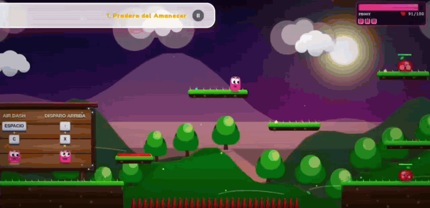
  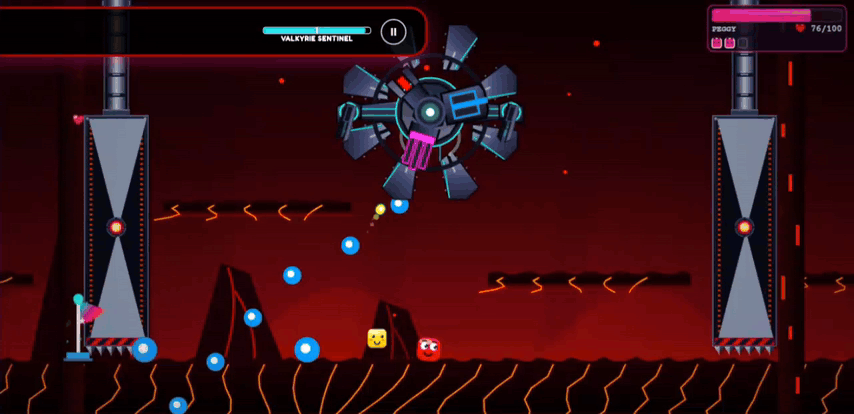
</p>
<p align="center">
  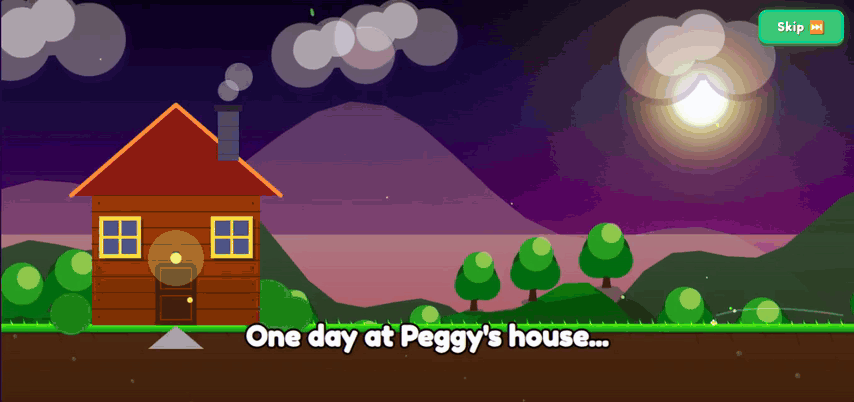
  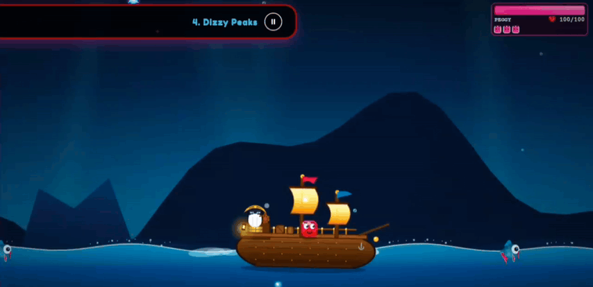
</p>
<p align="center">
  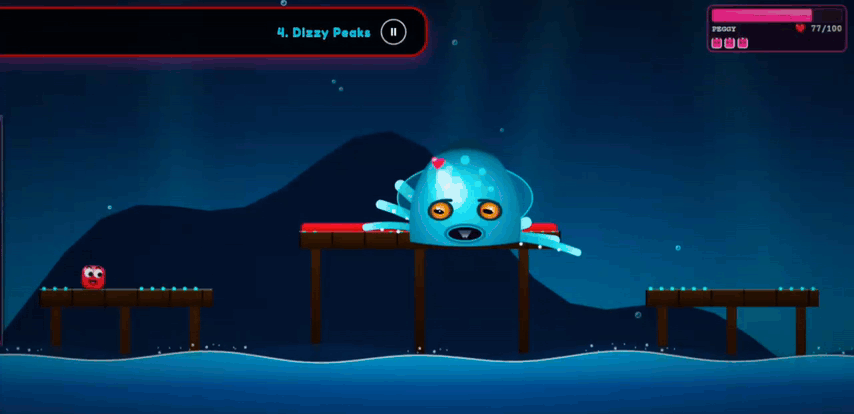
  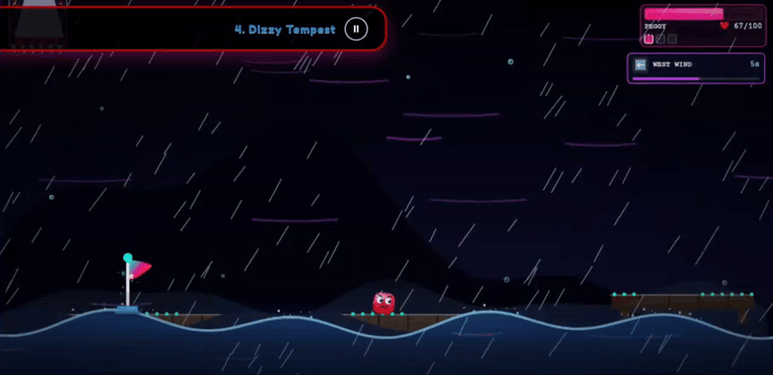
</p>
<p align="center">
  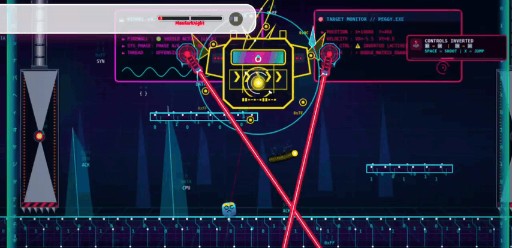
  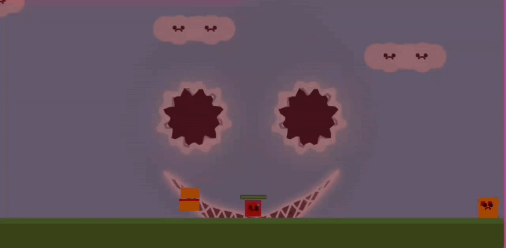
</p>
<p align="center">
  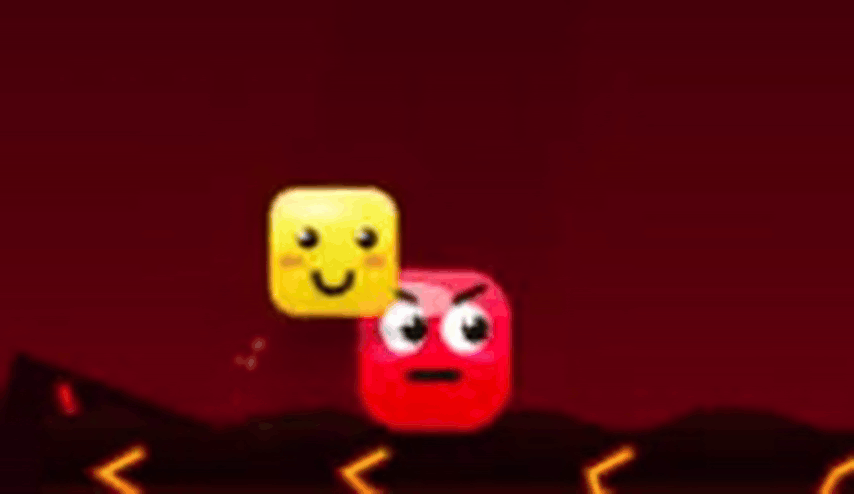
  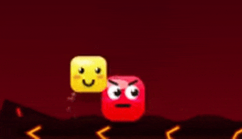
</p>

---

### Tecnologías utilizadas

- __HTML5 Canvas:__ Renderizado gráfico vectorial 2D y bucle de juego propio a 60 FPS.
- __Vanilla JavaScript (ES6+):__ Físicas de plataformas, colisiones AABB, inteligencia artificial de jefes y gestión de estados.
- __Web Audio API:__ Síntesis de sonido en tiempo real para efectos de audio de baja latencia.
- __CSS3:__ Diseño de interfaz de usuario (HUD) y diseño responsivo adaptativo.
- __FFmpeg:__ Optimización y compresión acústica de pistas musicales en formato MP3 para carga ultrarrápida.

---

### Cómo ejecutarlo localmente

Para revisar el código, ejecutar el juego en tu máquina o contribuir:

1. __Clonar el repositorio:__
   ```bash
   git clone https://github.com/cotera2024/Star-Cube.git
   cd Star-Cube
   ```

2. __Iniciar un servidor HTTP local:__
   Debido a las políticas de seguridad de los navegadores (CORS), no debes abrir `index.html` directamente haciendo doble clic (`file:///`). Es necesario usar un servidor local:

   - **Con Visual Studio Code**: Extensión **Live Server**, clic derecho en `index.html` -> **"Open with Live Server"**.
   - **Con Python 3**:
     ```bash
     python3 -m http.server 8000
     ```
   - **Con Node.js**:
     ```bash
     npx serve .
     ```

3. __Abrir en tu navegador:__
   Ingresa a `http://localhost:8000`.

---

### Autor y Contacto

* **Desarrollador**: Isaac Daniel Cotera (Cotera)
* **Año**: 2026
* **Itch.io**: [https://cotera.itch.io](https://cotera.itch.io)
* **GitHub**: [https://github.com/cotera2024](https://github.com/cotera2024)

---
---

<a id="english"></a>
## English

A 2D arcade platformer and shooter built entirely from scratch using **Vanilla JavaScript** and **HTML5 Canvas**. The entire game is rendered 100% with native procedural vector art, with zero sprites or external game engines!

---

### About the Game

*Star Cube* is an agile 2D platformer focused on swift movement: precise aerial control, omnidirectional dashing, and gradual charge shooting. It was engineered for ultra-low overhead to run smoothly on any modern desktop and mobile web browser.

You play as **Peggy**, an acrobatic cube. Your mission is to rescue your imprisoned friends across six distinct zones and defeat the bosses who command each world.

---

### Play Online Directly

You can play *Star Cube* instantly right now in your web browser across any of our official platforms:

* **GitHub Pages (Play Immediately):** [https://cotera2024.github.io/Star-Cube/](https://cotera2024.github.io/Star-Cube/)
* **Y8 Games (Global Arcade Portal):** [https://es.y8.com/games/starcube](https://es.y8.com/games/starcube)
* **Itch.io (Community & Comments):** [https://cotera.itch.io/star-cube](https://cotera.itch.io/star-cube)
* **Game Jolt (Community & Downloads):** [https://gamejolt.com/games/star-cube/1106176](https://gamejolt.com/games/star-cube/1106176)

---

### Key Features

- **6 Worlds with Unique Boss Encounters**:
  1. **World 1:** Explore the scenic Dawn Meadow and stunning Glacial Caverns. Face the icy specter (Ice Cube) who cursed the meadow, freezing it into an icy domain.
  2. **World 2:** Venture into a digitized grid. Battle electric foes and the rogue MawlerKnight, who hacks the system to disrupt your controls.
  3. **World 3:** Traverse molten lava rivers in the fiery volcano and defeat the Valkyrie Sentinel before you get incinerated.
  4. **World 4:** Sail your boat against rough oceanic waves and descend into abyssal depths to battle the Krakatoa Kraken.
  5. **World 5:** Delve into dark dungeons and conquer precision platforming trials to rescue your captured companions.
  6. **World 6:** Halloween Night. Navigate through thick fog with an interactive flashlight and escape the adrenaline-pumping chase of The Great Pumpkin.
- **Dynamic Sub-Worlds**: Portals and underground caverns that drastically alter physics, gravity, visibility, and terrain.
- **Dark Post-Game Mode**: Finishing the main story reveals an eerie metamorphosis into a dark nightmare dimension featuring altered dialogue, higher difficulty, and "The Hunt" mode (intense chase and melee slash mechanics).
- **Multi-Language Support**: Fully localized into Spanish, English, Japanese, Russian, and Chinese with interactive language switching and auto-detection.
- **Cross-Platform Controls**:
  - **Mobile:** Custom touch controls with virtual D-Pad, dedicated action buttons, and haptic response.
  - **PC:** Responsive keyboard input and native Gamepad support (Xbox, PlayStation, generic controllers) with vibration feedback.

---

### Controls

#### Keyboard (PC)
The game features two complete control schemes: **Classic** (Arrows + Space + C + X) and **Modern** (WASD + K + L + J):

| Action | Classic Scheme | Modern Scheme |
| :--- | :--- | :--- |
| **Move** | Arrow keys (`←` / `→`) | `A` / `D` keys |
| **Jump** | `Spacebar` | `K` key |
| **Dash** | `C` | `L` |
| **Shoot / Charge Plasma** | `X` (hold to charge levels 1 to 5) | `J` (hold to charge levels 1 to 5) |
| **Shoot Upward** | `↑` + `X` | `W` + `J` |
| **Shoot Downward (in air)** | `↓` + `X` | `S` + `J` |
| **Energy Dash** | `C` (with level 4 charge) | `L` (with level 4 charge) |
| **Cosmic Beam** | Release `X` (with level 5 MAX charge) | Release `J` (with level 5 MAX charge) |
| **Slash (Hunt Mode)** | `X` | `J` |
| **Interact / Enter** | Up Arrow (`↑`) in front of doors | `W` key in front of doors |
| **Pause** | `P` | `P` |

#### Touch Screen (Mobile / Tablet)
- **Virtual D-Pad**: Move left and right.
- **Action Buttons**: Jump, Dash, Attack (charge shot), and special Slash button during the post-game.
- **Fullscreen Button**: Maximizes screen viewport for distraction-free gaming.

#### Gamepad
- **Movement**: D-Pad or Left Stick.
- **Jump**: A (Xbox) / X (PlayStation).
- **Shoot / Charge**: X (Xbox) / Square (PlayStation).
- **Dash**: B / Shoulder Triggers / R1.

---

### Featured Module: High-Tech Turrets & Valkyrie Boss

If you want to inspect or integrate the standalone High-Tech Turrets system or the Valkyrie Boss into your projects, the code is open-source in its dedicated repository (100% Vanilla JS ES6 Modules):

- **Official Repository:** [https://github.com/cotera2024/Turrets-High-Tech](https://github.com/cotera2024/Turrets-High-Tech)

---

### Gameplay & Animation Gallery (10 Official GIFs)

Visual demonstration of dynamic gameplay mechanics, worlds, cinematics, and boss battles:

<p align="center">
  
  
</p>
<p align="center">
  
  
</p>
<p align="center">
  
  
</p>
<p align="center">
  
  
</p>
<p align="center">
  
  
</p>

---

### Built With

- **HTML5 Canvas:** Custom 2D vector renderer and fixed 60 FPS game loop.
- **Vanilla JavaScript (ES6+):** Pure platform physics, AABB collisions, boss AI state machines, and sound scheduling.
- **Web Audio API:** Real-time procedural audio synthesis for zero-latency sound effects.
- **CSS3:** Responsive UI layout, HUD overlays, and smooth menu animations.
- **FFmpeg:** High-efficiency MP3 audio compression and bitrate optimization for instant web loading.

---

### Running Locally

1. **Clone the repository:**
   ```bash
   git clone https://github.com/cotera2024/Star-Cube.git
   cd Star-Cube
   ```

2. **Start a local HTTP server:**
   Due to browser CORS security policies, do not open `index.html` via `file:///`. Use a local server:
   - **VS Code Live Server**: Right-click `index.html` -> **"Open with Live Server"**.
   - **Python 3**:
     ```bash
     python3 -m http.server 8000
     ```
   - **Node.js**:
     ```bash
     npx serve .
     ```

3. **Open in your browser:**
   Navigate to `http://localhost:8000`.

---

### Author & Contact

* **Developer**: Isaac Daniel Cotera (Cotera)
* **Year**: 2026
* **Itch.io**: [https://cotera.itch.io](https://cotera.itch.io)
* **GitHub**: [https://github.com/cotera2024](https://github.com/cotera2024)

---
*(c) 2026 Isaac Daniel Cotera. All rights reserved.*
